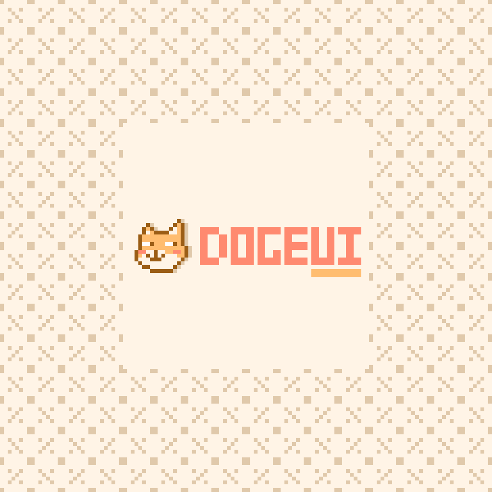
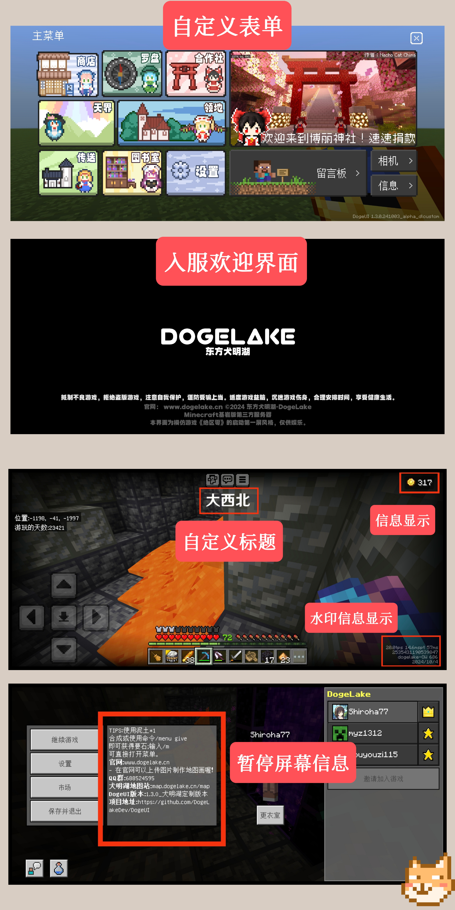

# DogeUI

一款为 BDS 服务器设计的通用 UI。  

> 本包包含了例子与使用文档，非开箱即用，请进行客制化之后再使用。

## 🏃🏻 作者

- `Shiroha77`
- `ENIACJushi`
## 🌠 展示

## 🍔 组件

| 组件名             | 介绍                                                                   | 分包链接                                                 | 是否弃用（停止更新） |
|--------------------|------------------------------------------------------------------------|----------------------------------------------------------|----------------------|
| DogeStartScreen    | 进服欢迎界面                                                           | https://www.minebbs.com/resources/6569/                  | 否                   |
| DogeMenu           | 自定义菜单实例                                                         |                                                          | 否                   |
| 底部水印信息       | 底部水印信息                                                           |                                                          | 否                   |
| 自定义图片标题实例 | 自定义图片标题实例                                                     |                                                          | 否                   |
| DogePauseScreen    | 暂停屏幕文字信息显示                                                   | https://www.minebbs.com/resources/dogepausescreen.6812/  | 否                   |
| DogeChatInfo       | 在聊天屏幕增加一个按钮来展示图片，可以用于查看服务器常用指令或公告等。 | https://www.minebbs.com/resources/dogechatinfo.6828/     | 是                   |
| DogePauseScreen    | 计分板顶部信息显示||否

# 🎈 开源
    Copyright (C) 2024 DogeLakeDev

    This program is free software: you can redistribute it and/or modify
    it under the terms of the GNU General Public License as published by
    the Free Software Foundation, either version 3 of the License, or
    (at your option) any later version.

    This program is distributed in the hope that it will be useful,
    but WITHOUT ANY WARRANTY; without even the implied warranty of
    MERCHANTABILITY or FITNESS FOR A PARTICULAR PURPOSE.  See the
    GNU General Public License for more details.

    You should have received a copy of the GNU General Public License
    along with this program.  If not, see <https://www.gnu.org/licenses/>.
