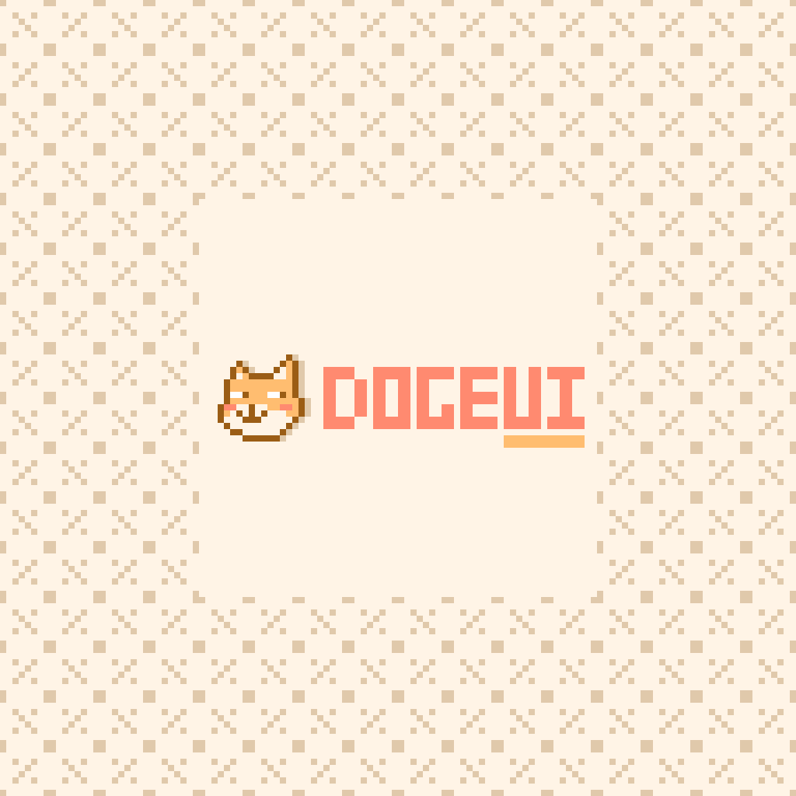
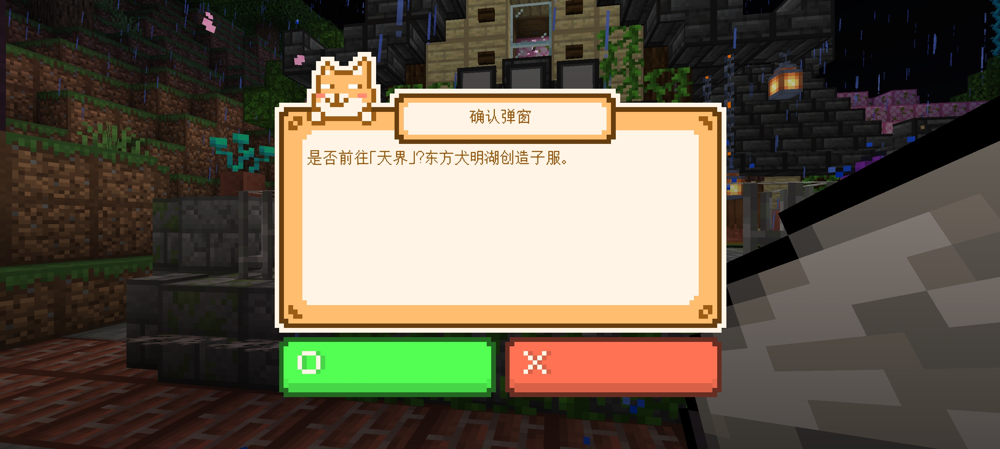
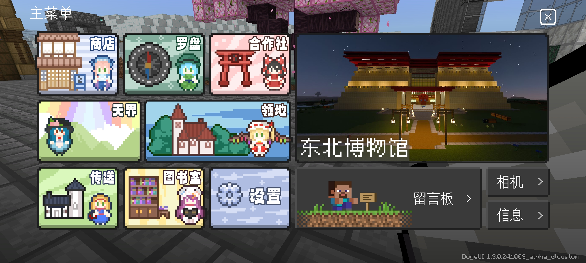
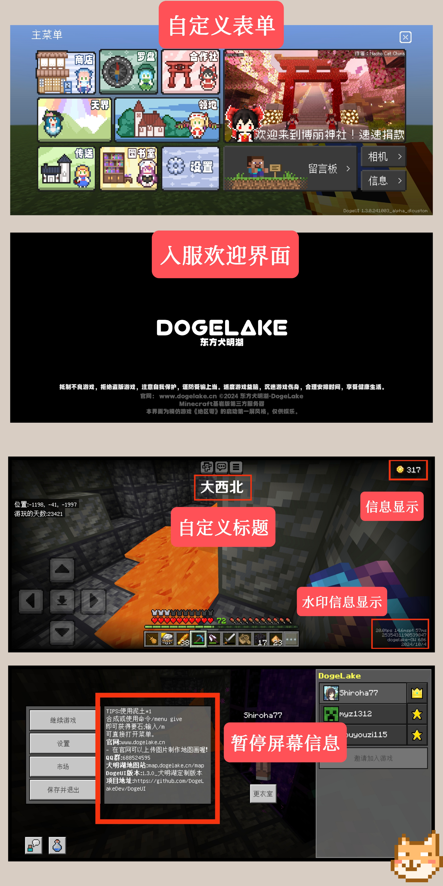

# DogeUI

一款为 BDS 服务器设计的通用 UI。  

> 本资源包包含了例子与使用文档，**部分内容非开箱即用**，请进行客制化之后再使用。

## 🏃🏻 作者

- `Shiroha77`
- `ENIACJushi`

## 🛠️ 包含内容

- 多项可自由定制的组件及其原创优质模板。
- 更改部分动画
- 修改点击音效
- 兼容性强。使用非侵入性修改，只改该改的内容，兼容大部分主流ui包、材质包。

## 🌠 原创内容展示

信息表单设计

东方犬明湖服务器主菜单设计

组件一览

## 🍔 组件

| 组件名 |   简介   |
|StartScreen||
|CustomMenu||
|HudInfo||
|PauseContent||
|ChatInfo||
|I||

## 🎈 开源信息

    Copyright (C) 2024 DogeLakeDev

    This program is free software: you can redistribute it and/or modify
    it under the terms of the GNU General Public License as published by
    the Free Software Foundation, either version 3 of the License, or
    (at your option) any later version.

    This program is distributed in the hope that it will be useful,
    but WITHOUT ANY WARRANTY; without even the implied warranty of
    MERCHANTABILITY or FITNESS FOR A PARTICULAR PURPOSE.  See the
    GNU General Public License for more details.

    You should have received a copy of the GNU General Public License
    along with this program.  If not, see <https://www.gnu.org/licenses/>.
